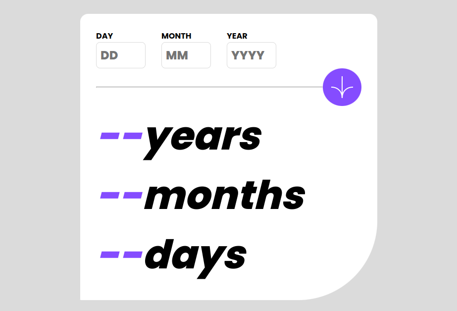

# Frontend Mentor - Age calculator app solution

This is a solution to the [Age calculator app challenge on Frontend Mentor](https://www.frontendmentor.io/challenges/age-calculator-app-dF9DFFpj-Q). Frontend Mentor challenges help you improve your coding skills by building realistic projects. 

## Table of contents

- [Overview](#overview)
  - [The challenge](#the-challenge)
  - [Screenshot](#screenshot)
  - [Links](#links)
- [My process](#my-process)
  - [Built with](#built-with)
  - [What I learned](#what-i-learned)
  - [Continued development](#continued-development)
  - [Useful resources](#useful-resources)
- [Author](#author)
- [Acknowledgments](#acknowledgments)

## Overview

### The challenge

Users should be able to:

- View an age in years, months, and days after submitting a valid date through the form
- Receive validation errors if:
  - Any field is empty when the form is submitted
  - The day number is not between 1-31
  - The month number is not between 1-12
  - The year is in the future
  - The date is invalid e.g. 31/04/1991 (there are 30 days in April)
- View the optimal layout for the interface depending on their device's screen size
- See hover and focus states for all interactive elements on the page

### Screenshot

### Links

- Solution URL: https://github.com/Mel-ca/age-calculator
- Live Site URL: https://mel-ca.github.io/age-calculator/

## Features

- Responsive design that works on desktop and mobile devices.
- Form validation that checks for empty fields, invalid dates, and future dates.
- Age calculation that takes into account leap years and the current date.

### Built with

- React
- Next.js
- Styled Components

### What I learned

While building this application, I learned how to:

Implement basic arithmetic operations in JavaScript.
Use event listeners to handle user input.
Manipulate the DOM to update the UI based on user input.

### Continued development

There are several ways to improve this application, such as:

- Implementing more advanced math operations, such as trigonometric functions.
- Improving the UI design to make it more visually appealing.
- Adding keyboard support for users who prefer to use their keyboard instead of clicking buttons.

### Useful resources

Here are some resources that I found helpful while building this application:

- MDN Web Docs - a comprehensive resource for web developers.
- W3Schools - another great resource for learning web development.
- JavaScript.info - a detailed guide to JavaScript.

## Author

- Frontend Mentor - [@melonielangat](https://www.frontendmentor.io/profile/melonielangat)
- Twitter - [@melonielangat](https://www.twitter.com/melonielangat)

## Acknowledgments

- Frontend Mentor for providing this challenge.

